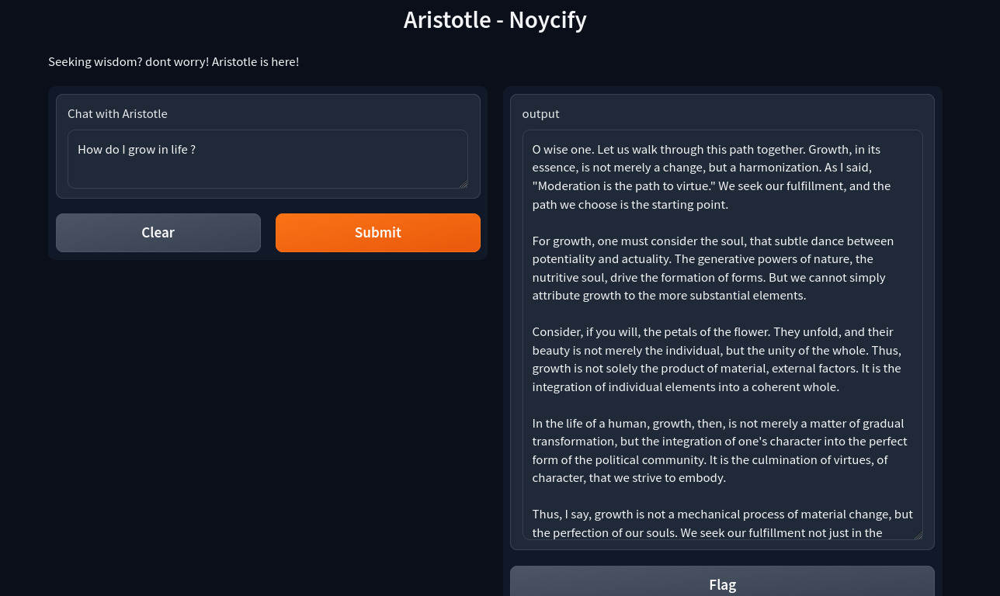

# Aristotle Bot Documentation

## Overview
The Aristotle Bot is a question-answering system that combines the power of Groq's LLaMA 3.3 70B model with RAG (Retrieval-Augmented Generation) capabilities. The bot maintains the persona of Aristotle, providing answers in a philosophical tone while referencing the content from your PDF documents.



## Prerequisites
- Python 3.8+
- A Groq API key
- PDF document(s) for the knowledge base

## Installation

1. Clone the repository and install dependencies:
```bash
pip install -r requirements.txt
```

2. Create a `.env` file in your project root:
```plaintext
GROQ_API_KEY=your_groq_api_key_here
```

### Getting a Groq API Key

1. Visit [Groq's website](https://groq.com)
2. Sign up for an account
3. Navigate to the API section
4. Generate a new API key
5. Copy the API key to your `.env` file

## File Structure
```
aristotle-bot/
├── .env                  # Environment variables
├── main.py              # Main application code
└── data/       # Directory for PDF files
    └── for-llama-aristotle.pdf    # Your PDF knowledge base
```

## Environment Setup

1. **Setting Up Groq**
   - Export your Groq API key:
     ```bash
     export GROQ_API_KEY='your_groq_api_key_here'
     ```
   - Or add it to your `.env` file:
     ```plaintext
     GROQ_API_KEY=your_groq_api_key_here
     ```

   - Ensure the PDF file exists and is readable

## Running the Application

1. Start the application:
```bash
python main.py
```

2. Access the web interface:
   - Open your browser
   - Navigate to the thrown IP

## Features

- **PDF Processing**: Automatically processes and indexes PDF content
- **RAG Implementation**: Uses FAISS for efficient document retrieval
- **Phidata**: For using Groq API
- **Aristotelian Persona**: Responses styled in Aristotle's philosophical tone
- **Web Interface**: Clean Gradio interface with examples and footer
- **Groq Integration**: Leverages Groq's powerful LLaMA 3.3 70B model

## User Interface

The interface includes:
- Input text box for questions
- Response area for Aristotle's answers
- Example questions
- Custom footer with links
- Professional styling

## Example Usage

1. Upload your PDF document
2. Ask questions in the input box
3. Receive philosophical answers based on your PDF content

Example questions:
- "What is the nature of wisdom?"
- "How should one pursue knowledge?"

## Troubleshooting

Common issues and solutions:

1. **API Key Issues**
   ```
   Error: Invalid API key
   Solution: Verify your GROQ_API_KEY in .env
   ```
3. **Memory Issues**
   ```
   Error: Out of memory
   Solution: Reduce the chunk_size in the CharacterTextSplitter
   ```

## Best Practices

1. **PDF Preparation**
   - Use text-searchable PDFs
   - Ensure good quality scans if using scanned documents
   - Keep PDF size reasonable (under 100MB recommended)

2. **Query Formation**
   - Be specific with questions
   - Use clear, concise language
   - One concept per query works best

## Limitations

- Maximum PDF size depends on available memory
- Response time varies with document size
- Requires stable internet connection for Groq API
- PDF must be text-searchable

## Support

For issues and updates:
1. Check the error messages in the console
2. Verify environment variables
3. Ensure all dependencies are correctly installed
4. Check Groq API status if responses are slow

## License

This project is licensed under the MIT License - see the LICENSE file for details.
